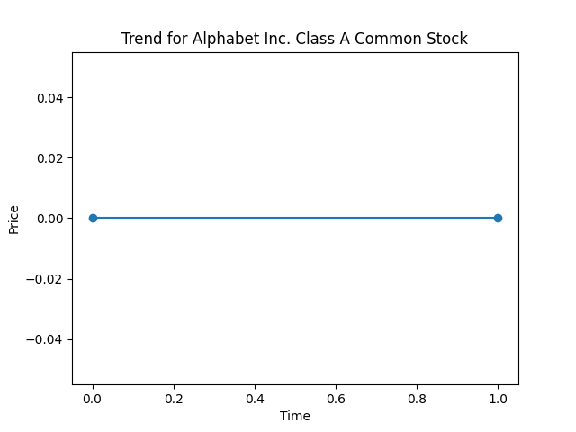

# 📈 Stock Trading Simulator

A **Python-based stock trading simulator** with **real-time market data** (via [Finnhub API](https://finnhub.io/)), a **Kivy/KivyMD desktop UI**, **MySQL backend** for persistent storage, and **pandas** for portfolio analysis.

This project was built as my **12th-grade year-end project** and serves as a beginner-friendly approach to **finance, data science, and app development**.

---

## ⚠️ Disclaimer

This is an **educational project** created for learning purposes.  
It is **not a fully functional stock trading app** and should not be used for real trading or financial decisions. Some features may be incomplete or simplified.

---

## ✨ Features

- 📊 **Real-Time Stock Data** – Fetch live stock prices using the **Finnhub API**.
- 💰 **Trading Simulation** – Buy/sell stocks with virtual money and track profit/loss.
- 📂 **Portfolio Management** – Manage holdings, balance, and transaction history.
- 🖥 **Interactive UI** – Modern desktop interface with **Kivy/KivyMD**.
- 🗄 **Database Backend** – MySQL for users, trades, and portfolio persistence.
- 📈 **Data Analysis with pandas** – Gain insights such as:
  - Profit/loss tracking
  - Portfolio performance over time
  - Simple Moving Averages (SMA)
- 🔍 **Stock Search & Watchlist** – Search by ticker symbol and add to a watchlist.
- 🎨 **Dark/Light Themes** – User-friendly theming with KivyMD.
- 🔐 **User Authentication** – Secure login/register system.

---

## 🖼 Screenshots

| Portfolio View                    | Stock Trend Example |
| --------------------------------- | ------------------- |
|  |    |

---

## 🛠 Tech Stack

- **Python** – Core logic
- **Kivy / KivyMD** – User interface
- **MySQL** – Database backend
- **pandas** – Data analysis
- **Finnhub API** – Real-time stock data

---

## 🚀 Installation & Setup

Follow these steps to set up the project on your system:

1. **Clone the repository**

   ```bash
   git clone https://github.com/your-username/stock-trading-simulator.git
   cd stock-trading-simulator
   ```

2. **Install dependencies**

   ```bash
   pip install -r requirements.txt
   ```

3. **Set up MySQL database**  
   Create the database and tables using the schema file:

   ```bash
   mysql -u root -p < schema.sql
   ```

   _(Edit `.env` if your MySQL username/password is different.)_

4. **Configure environment variables**  
   Copy the example environment file and fill in your values:

   ```bash
   cp .env.example .env
   ```

   Then edit `.env` with your details:

   ```ini
   FINNHUB_API_KEY=your_api_key_here
   MYSQL_USER=root
   MYSQL_PASSWORD=your_mysql_password
   MYSQL_HOST=localhost
   MYSQL_DATABASE=simplystock
   ```

5. **Run the app**
   ```bash
   python eoty_project.py
   ```

---

## 👨‍💻 Authors

- **Vinaykrish M K**

  - [GitHub](https://github.com/vin-404)
  - [LinkedIn](https://www.linkedin.com/in/vinaykrishmk)

- **Vidyut Chandrasekar**
  - [GitHub](https://github.com/XNightrider772X)
  - [LinkedIn](https://www.linkedin.com/)

---
